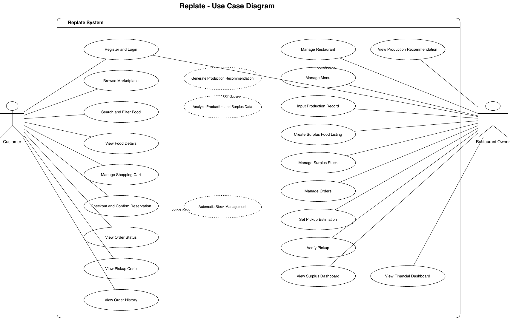
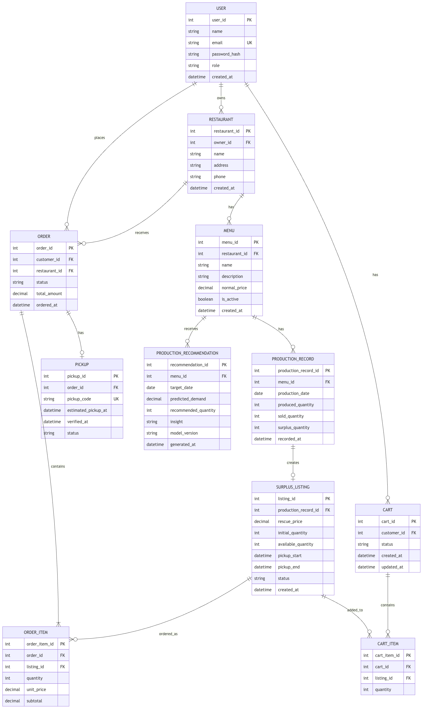
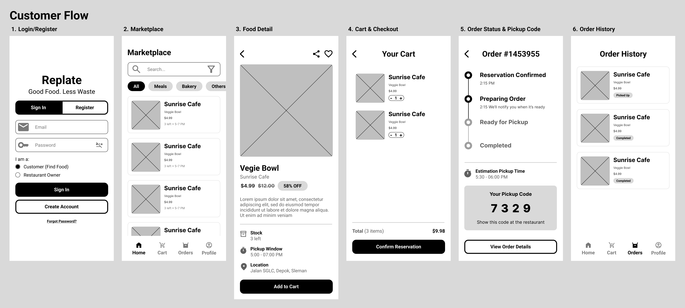
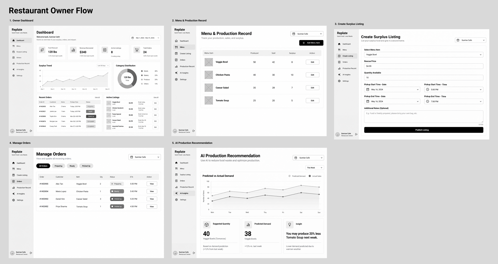

# Replate

Replate adalah *food rescue marketplace* yang membantu restoran menjual makanan surplus yang masih layak konsumsi dengan harga lebih terjangkau. Data produksi dan surplus nantinya digunakan untuk memberi rekomendasi produksi dan mengurangi *food waste*.

## Arsitektur

```text
Replate-Senpro/
├── frontend/   # Next.js static frontend → Azure Static Web Apps
├── backend/    # Express REST API + Prisma → Azure App Service
├── diagram/    # ERD, use case, dan wireframe
└── docs/       # Dokumentasi proyek
```

Database menggunakan SQL Server secara lokal dan Azure SQL saat deployment. Frontend hanya berkomunikasi dengan database melalui REST API.

## Menjalankan aplikasi

Gunakan Node.js 24 dan pnpm 10.

```bash
pnpm install
cp frontend/.env.example frontend/.env.local
cp backend/.env.example backend/.env
pnpm dev
```

Frontend berjalan di `http://localhost:3000` dan backend di `http://localhost:5000`. Isi `DATABASE_URL` dan ganti `JWT_SECRET` di `backend/.env` sebelum menjalankan backend.

Perintah workspace:

```bash
pnpm lint
pnpm test
pnpm build
```

Build frontend menghasilkan static export di `frontend/out`.

## REST API

- `GET /api/health`
- `POST /api/auth/register`
- `POST /api/auth/login`
- `GET /api/access/customer` untuk role `Customer`
- `GET /api/access/restaurant-owner` untuk role `RestaurantOwner`

Register menerima `name`, `email`, `password`, dan `role`. Kirim token dari register/login melalui header `Authorization: Bearer <token>` untuk mengakses endpoint berdasarkan role.

## Database migration

Schema Prisma mencakup seluruh entitas pada ERD Replate. Untuk Azure SQL atau SQL Server yang masih kosong:

```bash
pnpm --dir backend prisma:migrate
```

`DATABASE_URL` memakai format koneksi SQL Server:

```text
sqlserver://host:1433;database=Replate;user=user;password=password;encrypt=true
```

## Rencana deployment Azure

- Static output Next.js: Azure Static Web Apps.
- Express API: Azure App Service dengan Node.js 24.
- Database: Azure SQL Database.
- `NEXT_PUBLIC_API_URL` diarahkan ke URL App Service.
- `FRONTEND_URL` pada backend diarahkan ke origin Static Web Apps untuk CORS.

## Diagram









Kelompok 19:

- Violin Mulya Putra — 24/534192/TK/59201
- Putri Tajudin — 24/535824/TK/59469
- Diaz Amantajati Susilo — 24/545483/TK/60678
